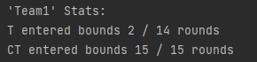
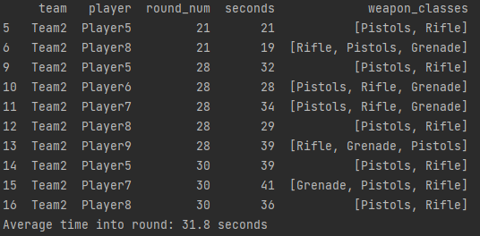
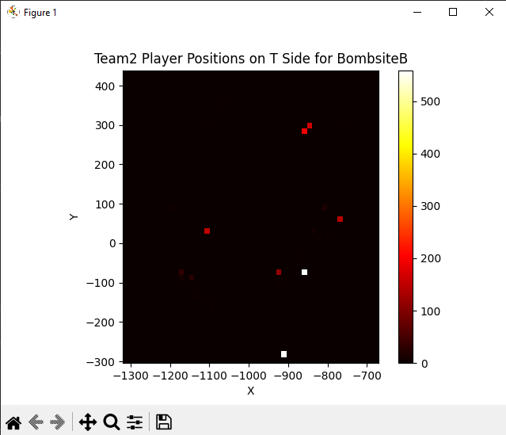

# EG-CS-Helper

## Description

A CounterStrike analysis solution used for providing insight on specific points in the match, 
like player positioning and common attack strategies.

For Genius League SWE internship assessment.

## Question/Answers

### 2a. 

Based off the results from the bound statistics, team 2 entered the boundaries 5 out of 15 rounds on T side.
33% of rounds entering through the boundary could be considered a common strategy for team 2.

### 2b.

The results from using the weapon site statistics show average of 31.8 seconds into the round on T side
that team 2 entered with at least 2 rifles/SMGs on BombsiteB.

### 2c.

Based off the heatmap generated for BombsiteB and CT side, we can note the most frequent player
coordinates being:
(-914, 279),
(-860, -72),
(-856, 285),
(-845, 299),
(-773, 64),
(-1101, 30)

Note that these coordinates are based off a heatmap for a minimum of 30 seconds into the round.

### 3.

To provide our coaching staff with an accessible solution, an easy to use command-line interface(CLI) 
solution would be my approach. 
A well-made solution would allow non-tech-savy users to get desired information and outputs without need for technical
knowledge.

By improving the CLI prompts and instructions, we can guide the coaching staff through the input process. 
They can provide the necessary match data, such as map details, boundary coordinates, and weapon preferences. 
The CLI will generate visualizations, including heatmaps, using the matplotlib library, providing them with clear 
insights into player positions, chokepoints, and other relevant information.

To ensure usability, we will develop comprehensive documentation, including installation instructions and input
guidelines.

By focusing on enhancing the existing CLI, we can deliver a user-friendly solution to our coaching staff within the
desired timeframe. While it may not have the visual sophistication of a GUI, it will provide them with valuable
analysis and insights in a straightforward and accessible manner.


## Usage

Using the ProcessGameState class, initialize an object using match data parquet.
```
game_state = ProcessGameState('game_state_frame_data.parquet')
```

### get_bound_stats()

Prints statistics of a team entering a provided boundary.

```
BOX_BOUNDS = ((-1735, 250), (-2806, 742), (-2472, 1233), (-1565, 580))
game_state.get_bounds_stats('Team1', BOX_BOUNDS)
```
Output:



### get_site_weapon_stats()

Prints output of rounds where provided weapons were used at least by 2 people into a bombsite.
Also provides average time into round where the teams entered the site.

```
game_state.get_site_weapon_stats('Team2', 'T', 'BombsiteB', ['Rifle', 'SMG'])
```
Output:



### get_site_heatmap()

Generates a heatmap for a given site of specified team/side with a minimum time into round 
threshold.

```
game_state.get_site_heatmap('Team2', 'T', 30, 'BombsiteB')
```
Output:



## Contacts

Joshua Chung - joshleechung@gmail.com

Project Link - https://github.com/jlchuun/EG-CS-Helper